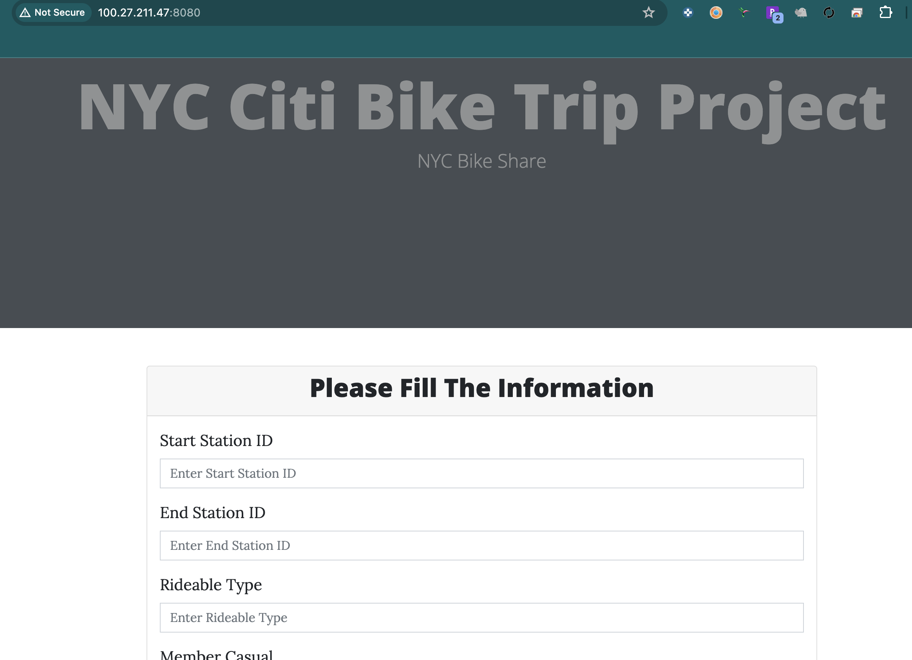
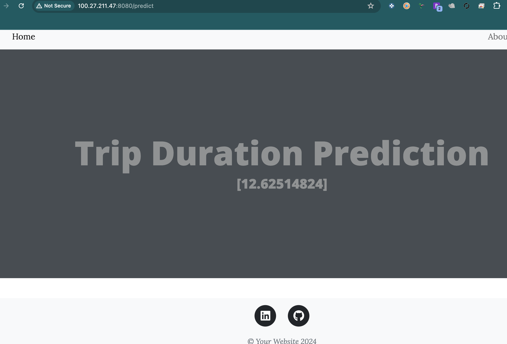

# NYC Bike Share Project

Welcome to the NYC Bike Share Project repository! This project aims to predict the trip duration of bike share trips in New York City using machine learning techniques. The project leverages various MLOps tools to create a robust, scalable, and monitored ML pipeline.

## Table of Contents

- [Introduction](#introduction)
- [Project Structure](#project-structure)
- [Pipeline](#pipeline)
- [Workflows](#workflows)
- [Setup](#setup)
- [Usage](#usage)
- [MLflow](#mlflow)
- [AWS-CICD-Deployment-with-Github-Actions](#aws-cicd-deployment-with-github-actions)
- [License](#license)

## Introduction

The goal of this project is to predict the duration of bike share trips in New York City. We use features such as trip distance, start station, and end station to train our machine learning models. The project is structured to ensure easy deployment, monitoring, and scalability using various MLOps tools.

## Project Structure

```plaintext
NYC-Bike-Share-Project/
│
├── .github/
│   └── workflows/
│
├── config/
│
├── mlruns/
│   └── 0/
│
├── research/
│
├── src/
│   └── mlProject/
│
├── static/
│
├── templates/
│
├── .gitattributes
├── .gitignore
├── Dockerfile
├── LICENSE
├── README.md
├── app.py
├── main.py
├── params.yaml
├── requirements.txt
├── schema.yaml
├── setup.py
├── template.py
└── test.py
```

## Pipeline

The pipeline of the project consists of the following stages:

- **Data Ingestion:** Fetch raw data from the NYC Bike Share dataset.
- **Data Preprocessing:** Clean and preprocess the data for model training.
- **Feature Engineering:** Calculate trip distances and prepare features.
- **Model Training:** Train the machine learning model using the prepared features.
- **Model Evaluation:** Evaluate the trained model on validation data.
- **Model Deployment:** Deploy the model for real-time predictions.


## Workflows

- Update `config.yaml`
- Update `schema.yaml`
- Update `params.yaml`
- Update the entity
- Update the configuration manager in `src/config`
- Update the components
- Update the pipeline
- Update `main.py`
- Update `app.py`

## Setup

1. Clone the repository:

    ```sh
    git clone https://github.com/kahramanmurat/NYC-Bike-Share-Project.git
    cd NYC-Bike-Share-Project
    ```
2. Create a conda environment and activate it:

    ```sh
    conda create -n mlproj python=3.8 -y
    conda activate mlproj
    ```
3. Install the required dependencies:

    ```sh
    pip install -r requirements.txt
    ```
4. Set up the necessary environment variables:

    ```sh
    export MLFLOW_TRACKING_URI=https://dagshub.com/kahramanmurat/NYC-Bike-Share-Project.mlflow
    export MLFLOW_TRACKING_USERNAME=kahramanmurat
    export MLFLOW_TRACKING_PASSWORD=""
    ```

## Usage

To run the pipeline, execute the following command:

    ```sh
    python app.py
    ```

    http://localhost:8080

## MLflow

MLflow is used to track experiments, log metrics, and manage model versions. DagsHub is used for managing data and model versioning.

Set environment variables for DagsHub:

    ```sh
    export MLFLOW_TRACKING_URI=https://dagshub.com/kahramanmurat/NYC-Bike-Share-Project.mlflow
    export MLFLOW_TRACKING_USERNAME=kahramanmurat
    export MLFLOW_TRACKING_PASSWORD=""
    ```
## AWS-CICD-Deployment-with-Github-Actions

Steps for Deployment

1. Login to AWS console.
2. Create IAM user for deployment with specific access:
    - EC2 access for virtual machine
    - ECR for storing Docker images
    - Attach policies: `AmazonEC2ContainerRegistryFullAccess` and `AmazonEC2FullAccess`
3. Create ECR repository: `963656558707.dkr.ecr.us-east-1.amazonaws.com/mlproj2`
4. Create EC2 machine (Ubuntu)
5. Install Docker in EC2 Machine

    ```sh
    sudo apt-get update -y
    sudo apt-get upgrade
    curl -fsSL https://get.docker.com -o get-docker.sh
    sudo sh get-docker.sh
    sudo usermod -aG docker ubuntu
    newgrp docker
    ```

6. Configure EC2 as self-hosted runner:
    - Go to `Settings` > `Actions` > `Runner` > `New self-hosted runner`
    - Choose OS
    - Run commands one by one
7. Setup GitHub secrets:
    - `AWS_ACCESS_KEY_ID`
    - `AWS_SECRET_ACCESS_KEY`
    - `AWS_REGION=us-east-1`
    - `AWS_ECR_LOGIN_URI=963656558707.dkr.ecr.us-east-1.amazonaws.com`
    - `ECR_REPOSITORY_NAME=mlproj`


## License

This project is licensed under the MIT License - see the LICENSE file for details.


NYC Bike Share Project deployed in AWS:

Data Entry:


Prediction:

